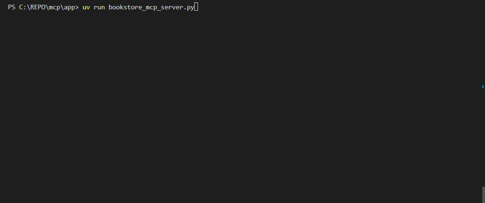

# Create MCP Server with OpenAPI Spec File

- Easily turn any OpenAPI spec into a set of LLM-accessible tools using the Model Context Protocol (MCP).

- 

- This example is using https://fakerestapi.azurewebsites.net/index.html API

## MCP Architecture

- 

- **MCP Hosts**: Programs like Claude Desktop, IDEs, or AI tools that want to access data through MCP.
- **MCP Clients**: Protocol clients that maintain 1:1 connections with servers.
- **MCP Servers**: Lightweight programs that expose specific capabilities through the standardized Model Context Protocol.
- **Data Sources**: Your computer’s files, databases, and services that MCP servers can securely access.
- **Remote Services**: External systems available over the internet (e.g., through APIs) that MCP servers can connect to.

> Let's MCPise our APIs now!

## Overview

This repository provides an example of a Model Context Protocol (MCP) server that dynamically exposes API endpoints as tools using an OpenAPI specification. It leverages the FastMCP framework to generate a server from an OpenAPI spec (such as a Swagger Bookstore API), and provides both a client and an interactive chatbot interface for interacting with the server using LLM-based agents (via LangChain and LangGraph).

## Features

- **Dynamic API Exposure:** Loads an OpenAPI spec (e.g., `open-api_-spec.json`) and exposes its GET endpoints as callable tools via FastMCP.
- **LLM Integration:** The client and test scripts use OpenAI models (via LangChain) to interact with the server, allowing natural language queries to be mapped to API calls.
- **Bookstore Example:** The main example is a Bookstore API, but the architecture is generic and can be adapted to any OpenAPI spec.
- **Streaming & SSE:** The server uses Server-Sent Events (SSE) for real-time communication with clients.

## Main Components
- **Dynamic API Exposure:** Loads an OpenAPI spec (e.g., `open-api_-spec.json`) and exposes its GET endpoints as callable tools via FastMCP.
- **LLM Integration:** The client and test scripts use OpenAI models (via LangChain) to interact with the server, allowing natural language queries to be mapped to API calls.
- **Bookstore Example:** The main example is a Bookstore API, but the architecture is generic and can be adapted to any OpenAPI spec.
- **Streaming & SSE:** The server uses Server-Sent Events (SSE) for real-time communication with clients.

## Main Components

- `bookstore_mcp_server.py`: Starts the FastMCP server from an OpenAPI spec, exposing endpoints as tools.
- `bookstore_mcp_client.py`: Example client that connects to the MCP server and invokes tools using an LLM agent.
- `bookstore_interactive_agent.py`: Interactive chatbot for testing the server with natural language queries.
- `pyproject.toml`: Project metadata and dependencies.

## Getting Started

1. Place your OpenAPI spec (e.g., `openapi_spec.json`) in the project root.
2. Install dependencies as specified in `pyproject.toml`.
3. Run `bookstore_mcp_server.py` to start the server:
   ```sh
   uv run bookstore_mcp_server.py
    ```
4. Use bookstore_mcp_client.py or bookstore_interactive_agent.py to interact with the server:
    ```sh
    uv run bookstore_mcp_client.py
    # or
    uv run bookstore_interactive_agent.py
```
For more details, see the code and comments in each file.
